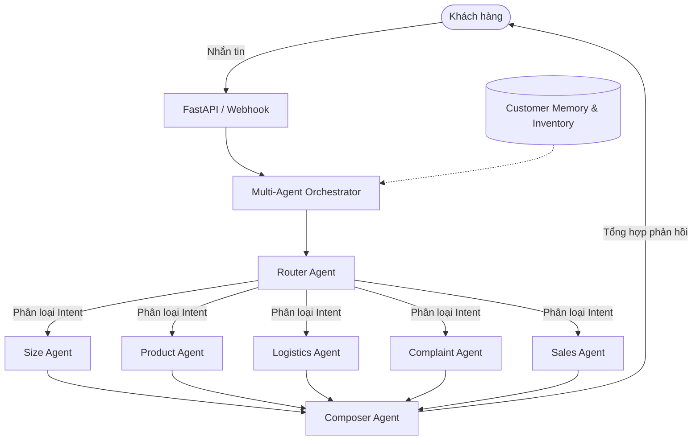

# Cấu Trúc Kỹ Thuật: Antigravity Multi-Agent Fashion CS System

Dự án này là một hệ thống Chăm sóc khách hàng (Customer Service) dành cho thương hiệu thời trang TMĐT cao cấp, được vận hành bởi một tổ hợp Đa Tác Nhân AI (Multi-Agent).

## 1. Kiến Trúc Tổng Thể (System Architecture)

Hệ thống được thiết kế theo mô hình Client-Server kết hợp Real-time Socket.
- **Frontend:** Xây dựng giao diện ứng dụng web cho nhân viên CSKH (Dashboard) bằng `Next.js`.
- **Backend:** Xây dựng máy chủ API và xử lý lõi AI bằng `FastAPI` (Python).
- **Cơ sở dữ liệu:** `SQLite` (với SQLAlchemy ORM).
- **Kết nối Real-time:** `Socket.IO` để nhận và gửi tin nhắn tức thời (giả lập các nền tảng chat như Shopee/TikTok/Facebook).

---

## 2. Lõi Trí Tuệ Nhân Tạo (Multi-Agent AI Core)

Được nâng cấp từ Single-Agent lên kiến trúc **Multi-Agent Orchestration** để xử lý các nghiệp vụ phức tạp của ngành thời trang. Các tác vụ được phân mảnh để tăng độ chính xác và giảm hallucination.



### Các Agent chuyên biệt:
1. **Router Agent:** Đọc tin nhắn và quyết định cần gọi chuyên gia nào (nhận diện intent).
2. **Size Recommendation Agent:** Chuyên gia form dáng, số đo, chất liệu co giãn.
3. **Product Knowledge Agent:** Chuyên gia thông tin sản phẩm, cách phối đồ.
4. **Logistics Agent:** Chuyên gia theo dõi vận đơn, giao hàng.
5. **Complaint Recovery Agent:** Chuyên gia xử lý khiếu nại, xoa dịu cảm xúc.
6. **Sales Conversion Agent:** Chuyên gia bán hàng, upsell/cross-sell.
7. **Composer Agent:** Tổng hợp ý kiến từ các chuyên gia thành một câu trả lời duy nhất mang phong cách "Premium Fashion".

---

## 3. Cấu Trúc Thư Mục (Directory Structure)

### Backend (`/backend`)
```text
backend/
├── main.py                     # Entry point của FastAPI & Socket.IO
├── .env                        # Biến môi trường (OpenAI API Key, Tokens)
├── cs_agent.db                 # Database SQLite
├── uploads/                    # Thư mục lưu trữ hình ảnh tải lên
├── app/
│   ├── agents/                 # Thư mục lõi chứa Multi-Agent System
│   │   ├── orchestrator.py     # Điều phối luồng chạy các Agent
│   │   ├── router_agent.py     # Nhận diện intent
│   │   ├── specialist_agents.py# Chứa 5 prompt chuyên môn
│   │   └── composer_agent.py   # Tổng hợp câu trả lời cuối
│   ├── core/
│   │   ├── config.py           # Quản lý cấu hình (BaseSettings)
│   │   └── database.py         # Kết nối SQLAlchemy
│   ├── models/
│   │   ├── models.py           # SQLAlchemy Models (Conversation, Message, AgentConfig...)
│   │   └── schemas.py          # Pydantic Schemas (Validation)
│   ├── routers/                
│   │   ├── conversations.py    # API quản lý hội thoại, gửi/nhận tin nhắn và ảnh
│   │   ├── analytics.py        # API thống kê
│   │   └── webhooks.py         # Điểm nhận dữ liệu từ các nền tảng (Shopee/TikTok/FB)
│   └── services/
│       ├── ai_service.py       # Cầu nối gọi Orchestrator, xử lý Fallback Mock
│       ├── message_service.py  # Lưu tin nhắn vào DB, trigger AI, gửi Socket
│       └── document_service.py # Xử lý RAG và Vector Embeddings (Kiến thức)
```

### Frontend (`/frontend`)
```text
frontend/
├── package.json                # Dependencies (Next.js, React, Socket.io-client)
├── src/
│   ├── app/                    # Next.js App Router (Pages & Layouts)
│   ├── components/             # Reusable UI Components
│   │   ├── chat/               # Giao diện khung Chat (ChatWindow, MessageBubble)
│   │   └── dashboard/          # Giao diện thống kê
│   ├── lib/
│   │   ├── api.ts              # Cấu hình Axios gọi xuống Backend
│   │   └── socket.ts           # Kết nối và lắng nghe Socket.IO
│   └── types/                  # TypeScript Interfaces (Message, Conversation...)
```

---

## 4. Các Luồng Dữ Liệu Quan Trọng (Data Flows)

1. **Luồng nhận tin nhắn (Inbound):**
   Khách nhắn tin (via Webhook/Mock) -> `message_service.process_incoming_message` -> Lưu DB -> Gọi AI `ai_service.get_ai_response` -> Bắn Socket `new_message` lên UI cho nhân viên thấy.
   
2. **Luồng xử lý hình ảnh:**
   Khách gửi hình ảnh -> Frontend chuyển thành `base64` -> Gọi API `/api/conversations/{id}/messages` -> Backend chuyển thành file tĩnh lưu ở `/uploads` -> URL hình ảnh được lưu vào DB và cấp cho OpenAI Vision phân tích.

3. **Luồng Fallback an toàn (Mock Mode):**
   Nếu OpenAI API lỗi (VD: hết quota, lỗi 429), `ai_service.py` sẽ chặn lỗi bằng lệnh `try...except` và tự động chuyển sang _mock_response. Mock Response vẫn sử dụng logic if/else để nhận diện keyword và gửi phản hồi hợp lý mà không làm sập ứng dụng.
